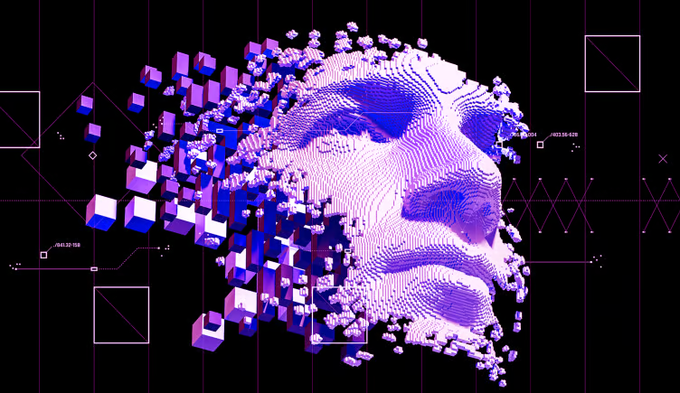

# FIAP MBA em Data Science & Inteligência Artificial 

Informações sobre o curso acesse [aqui](https://www.fiap.com.br/live/mba/mba-em-data-science-artificial-intelligence/).

Este repositório reúne todos os notebooks, imagens, modelos e demais materiais necessário para a condução das aulas e revisão das mesmas.

## Cognitive Platforms

Nas aulas podemos utilizar o Google Colab, os Notebooks do Kaggle ou a própria distribuição local Anaconda, com uso do Jupyter Notebook, que há vem instalado nesta distribuição. Você também pode usar até mesmo o VSCode, escolha o ambiente que mais adeque ao seu estilo!

Para instalar o Anaconda, acesse a sessão de [Downloads](https://www.anaconda.com/download) do Anaconda.

Tanto o [Google Colab](https://colab.research.google.com/) ou [Kaggle](https://www.kaggle.com/) podem ser acessados diretamente dos respectivos sites.

## Aula 1: Introdução a plataformas congitivas e AWS

1. Tipos de plataformas cognitivas
2. Quando utilizar e casos de uso mais comum
3. Quadrante Gartner de provedores públicos

### Plataforma AWS

1. Introdução a AWS
2. Sagemaker Canvas
3. Biblioteca Boto3
4. Amazon Textract
5. Amazon Rekognition 
6. Amazon Comprehend

 

### Desafio

1. Face match

## Aula 2: Imagem, áudio e transcrição

1. Amazon Polly
2. Amazon Transcribe
3. Amazon Rekognition Custom Labels
4. Amazon Rekognition Imagem Moderation

 

## Aula 3: LLMs com AWS e OpenAI

1. Amazon Bedrock
2. Introdução a OpenAI
3. Introdução a Langchain

 

## Aula 4: LLMs com Langchain

1. Templates de Prompt
2. Memória
3. Encadeamento
4. Dados externos
5. Agentes

 

### Desafio

1. Análise de Avaliações

2. Agente autônomo para dados médicos

